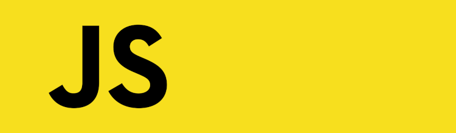
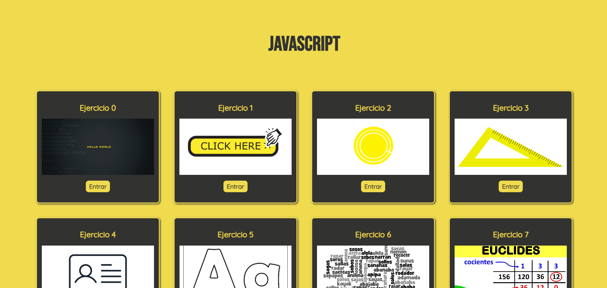

<h1>MEMORIA PORTFOLIO JAVASCRIPT</h1>
 

<h2>Indice</h2>
<ul>
  <li><a href="#introduccion">Introducción</a></li>
  <li><a href="#estructura">Estructura</a></li>
  <li><a href="#snippets">Code Snippets</a></li>
  <li><a href="#estilo">Estilo</a></li>
  
</ul>

<h2 id="introduccion">Introducción</h2>

Trabajo realizado por Alba Romero

Proyecto de web realizado con bootstrap, html, css y JS

Trabajo realizado con fines educativos

Mayo de 2024

CopyRight ©

<h2 id="estructura">Estructura</h2>

La web muestra una página principal en la que se pueden apreciar 11 cards, una por cada ejercicio realizado

 

 

Ejercicio 0: Crea una página web, en la que, al ingresar, se muestre el mensaje “Hola mundo” mediante un Alert

Ejercicio 1: Crea una página web, en la que, al ingresar, se muestre el mensaje “Hola mundo” tras pulsar un botón

Ejercicio 2: Invoca desde una página html el código JS que te pida, mediante formulario, el radio de
una circunferencia y te muestre en la propia página tres resultados:
a. Longitud de la circunferencia que corresponde a ese radio
b. Área del círculo
c. Volumen de la esfera

Ejercicio 3: 

Ejercicio 4: 

Ejercicio 5: 

Ejercicio 6: 

Ejercicio 7: 

Ejercicio 8: 

Ejercicio 9: 

Ejercicio 10: 

Ejercicio 11: 

<h2 id="snippets">Code snippets</h2>

He utilizado los siguientes:

<ul>
  <li>Barra de navegación: Tomada de GetBootstrap (https://getbootstrap.com/docs/5.0/components/navbar/)</li>
  <li>Slider de galería: Tomada de GetBootstrap (https://getbootstrap.com/docs/5.0/components/carousel/)</li> 
  <li>Cards:Tomado de FreeFrontend (https://freefrontend.com/bootstrap-cards/)</li>
  <li>Form: Tomado de MDBootstrap (https://mdbootstrap.com/docs/b4/jquery/forms/contact/)</li>
  <li>Footer: Tomado de MDBootstrap (https://mdbootstrap.com/snippets/standard/mdbootstrap/2885047?view=side)</li>
  <li>Modal: Tomado de GetBootstrap (https://getbootstrap.com/docs/4.0/components/modal/)</li>
</ul>

<h2 id="estilo">Estilo</h2>
<h3>Paleta de colores</h3>
<ul>
· Tono blanco (#White)
</ul>
<ul>
· Tonos verdes (rgba(5, 164, 122, 0.932), rgba(20, 210, 159, 0.932), #81d7c0e8, etc.)
</ul>
 
<h3>Tipografías</h3>
<ul>
· DancingScript-VariableFont_wght
</ul>
<ul>
· LilitaOne-Regular
</ul>
<ul>
· Oswald-VariableFont_wght
</ul>
 
<h3>Imágenes</h3>
<ul>
· Flickr
</ul>
<ul>
· Civatatis
</ul>
<ul>
· ElMundo
</ul>
<ul>
· AbcMallorca
</ul>
<ul>
· ElPaís
</ul>
<ul>
· Etc...
</ul>
 
